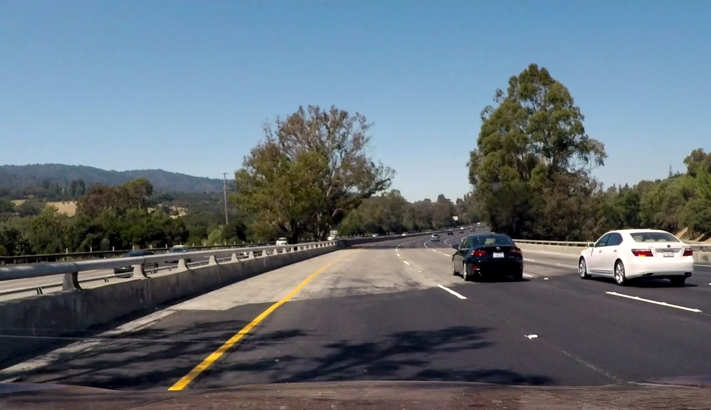

# **Finding Lane Lines on the Road** 

---

The goals / steps of this project are the following:
* Make a pipeline that finds lane lines on the road
* Reflect on your work in a written report
---


### Reflection

### 1. Describe your  pipeline. As part of the description, explain how you modified the function that draws lines.

> My pipeline consists of 5 major steps. For convinience I combined all steps and put as a method into a class called `class LaneTracker`

**The pipeline:**
  * takes a single 3-channel RGB image filters white and yellow lines
  * grayscales it and blurs
  * detects edges
  * finds the lines of interest iside a particular region of the image
  * draws all the required elements on top of the image.

---
```python
def process_image(self, image):
    if image.shape[0] > 540 and image.shape[1] > 960:
        image     = self.resize(image)
    masked    = self.yellow_white_masks(image)
    gray      = self.grayscale(masked)
    blur      = self.gaussian_blur(gray, self.kernel_size)
    edges     = self.canny(blur, self.low_threshold, self.high_threshold)
    roi       = self.region_of_interest(edges)
    two_lines = self.two_hough_lines(roi, self.rho, self.theta, self.threshold, self.min_line_len, 
                                     self.max_line_gap)
    result    = self.weighted_img(two_lines, image)
    return result
```

---

### **The steps:**

### 1 - Build a filter to find the white and yellow parts:

---
```python
def yellow_white_masks(self, img):
    # convert to HSL
    img = cv2.cvtColor(img, cv2.COLOR_RGB2HLS)
    # find white lane bounds
    lower_white = np.array([0, 190, 0], dtype=np.uint8)
    upper_white = np.array([180, 255, 255], dtype=np.uint8)
    white_mask = cv2.inRange(img, lower_white, upper_white)
    # find yellow lane bounds
    lower_yellow = np.array([0, 70, 100], dtype=np.uint8)
    upper_yellow = np.array([100, 250, 255], dtype=np.uint8)
    yellow_mask = cv2.inRange(img, lower_yellow, upper_yellow)
    # combine yellow and white
    yell_white = cv2.bitwise_or(white_mask, yellow_mask)
    masked = cv2.bitwise_and(img, img, mask=yell_white)
    return masked
```

---

> Since the pipeline depends on the correct color segmentation I'm using HLS color-space for detection of yellow and white regions because standard RGB palette is not suitable for this. I tried HSV as well; however, HLS gives me the best result.

> Here is a good explanation of [HSV and HLS color-spaces](https://en.wikipedia.org/wiki/HSL_and_HSV) 

#### After applying mask filter I've got this (original image, HLS convertion, masked image):

<table>
<tr>
<td></td>
<td></td> 
<td></td>
</tr>
</table>


### 2 - Grayscale and blur image in order to prepare it for passing to canny edge detection filter:

---
```python
def grayscale(self, img):
    return cv2.cvtColor(img, cv2.COLOR_RGB2GRAY)
    
def gaussian_blur(self, img, kernel_size):
    return cv2.GaussianBlur(img, (kernel_size, kernel_size), 0)
```

---

parameter `kernel_size` (size of a gaussian filter) was set when the LaneTracker was initiated


```pyton
self.kernel_size = 5
```


#### Output (grayscale, blur):

<table>
<tr>
<td></td> 
<td></td>
</tr>
</table>


### 3 - Canny edge detection filter:

> [Canny edge detection](https://en.wikipedia.org/wiki/Canny_edge_detector) is an algorithm that calculates the intensity gradients of the image and applies double threshold to determine edges.

parameters:

```python
self.low_threshold   = 50
self.high_threshold  = 150
```

---
```python
def canny(self, img, low_threshold, high_threshold):
        return cv2.Canny(img, low_threshold, high_threshold)
```

---

#### Output:


### 4 - Region of interest and hough transform:

> In order to find lane lines I need to check just the particular region of the image as far as the camera placement is determined and the camera itself is stable.
> Getting rid of irrelevant pixels makes finding lane lines a much easier task.

---
```python
def find_vertices(self, imshape):
    bottom_left = (0, imshape[0])
    bottom_right = (imshape[1], imshape[0])
    top_left = ((imshape[1]/2 - imshape[1]*0.03), imshape[0]/1.6)
    top_right = ((imshape[1]/2 + imshape[1]*0.03), imshape[0]/1.6)
    vertices = np.array([[bottom_left, top_left, top_right, bottom_right]], dtype=np.int32)
    return vertices
    
def region_of_interest(self, img):
    vertices  = self.find_vertices(img.shape)
    #defining a blank mask to start with
    mask = np.zeros_like(img)   
    #defining a 3 channel or 1 channel color to fill the mask with depending on the input image
    if len(img.shape) > 2:
        channel_count = img.shape[2]  # i.e. 3 or 4 depending on image
        ignore_mask_color = (255,) * channel_count
    else:
        ignore_mask_color = 255
    #filling pixels inside the polygon defined by vertices with the fill color    
    cv2.fillPoly(mask, vertices, ignore_mask_color)
    #returning the image only where mask pixels are nonzero
    masked_image = cv2.bitwise_and(img, mask)
    return masked_image
```

---

#### Output:


> Next step: [Hough transform](https://en.wikipedia.org/wiki/Hough_transform) to detect lines. When we have edges from canny detection we can connect them using lines.

parameters:

```python
self.rho             = 1            # distance resolution in pixels of the Hough grid
self.theta           = np.pi/180    # angular resolution in radians of the Hough grid
self.threshold       = 40           # minimum number of votes (intersections in Hough grid cell)
self.min_line_len    = 40           # minimum number of pixels making up a line
self.max_line_gap    = 250          # maximum gap in pixels between connectable line segments
```


**NOTE: Inside this function I average all found lines and get coordinates of left and right lines (one per detected lane). I use slope min/max range for left and right lines to filter out outliers. Also I implemented buffering that helps to make lines smoother when the pipeline used on videos, but more on this later**

---
```python
def two_hough_lines(self, img, rho, theta, threshold, min_line_len, max_line_gap):
    # hough transform
    lines = cv2.HoughLinesP(img, rho, theta, threshold, np.array([]), minLineLength=min_line_len,
                            maxLineGap=max_line_gap)
    line_img = np.zeros((img.shape[0], img.shape[1], 3), dtype=np.uint8)
    # calculate average left and right slope/intercept in order to draw a single line for each lane
    right_slope_intercept, left_slope_intercept = self.lines_filter(lines)
    # find endopints for lines to draw 
    shape = img.shape
    right_line = self.line_endpoints(shape, right_slope_intercept)
    left_line = self.line_endpoints(shape, left_slope_intercept)
    # check if lines detected successfully
    if right_line is None:
        if self.buffer_right:
            right_line = np.mean(self.buffer_right, axis=0, dtype=np.uint32)
    if left_line is None:
        if self.buffer_left:
            left_line = np.mean(self.buffer_left, axis=0, dtype=np.uint32)
    else:
        self.buffer_right.append(right_line)
        self.buffer_left.append(left_line)
        right_line = np.mean(self.buffer_right, axis=0, dtype=np.uint32)
        left_line = np.mean(self.buffer_left, axis=0, dtype=np.uint32)
    # draw lines
    two_lines = [right_line, left_line]
    color = [255, 0, 0]
    thickness = 10
    for line in two_lines:
        cv2.line(line_img, (line[0], line[1]), (line[2], line[3]), color, thickness)
    return line_img
```

---


parameters:

```python
self.min_left_slope  = 0.5
self.max_left_slope  = 0.7
self.min_right_slope = -0.9
self.max_right_slope = -0.5
```

---
```python
def lines_filter(self, lines):
    # Right lines: slope < 0; Left lines:  slope > 0 
    right_line_parameters = []
    left_line_parameters = []
    for line in lines:
        for x1,y1,x2,y2 in line:
            if x1==x2 or y1==y2:
                continue
            slope  = ((y2-y1)/(x2-x1))
            intercept = y1 - slope*x1
            # initalizing slope control and keep only lines of interest
            if slope > 0 and slope > self.min_left_slope and slope < self.max_left_slope:
                left_line_parameters.append([slope, intercept])
            if slope < 0 and slope > self.min_right_slope and slope < self.max_right_slope:
                right_line_parameters.append([slope, intercept])
    # average parameters to form only one line per detected lane
    right_slope_intercept = np.mean(right_line_parameters, axis=0)
    left_slope_intercept = np.mean(left_line_parameters, axis=0)
    return right_slope_intercept, left_slope_intercept

def line_endpoints(self, shape, slope_intercept):
    # check if some missing values (meaning no line detected)
    try:
        slope = slope_intercept[0]
        intercept = slope_intercept[1]
    except:
        return None

    slope = slope_intercept[0]
    intercept = slope_intercept[1]
    y1 = int(shape[0])
    x1 = int((y1 - intercept)/slope)
    y2 = int(shape[0]/1.6)
    x2 = int((y2 - intercept)/slope)
    return [x1, y1, x2, y2]
```

---

#### Output (all detected lines, averaged two lines):

<table>
<tr>
<td></td> 
<td></td>
</tr>
</table>


### 5 - Result:

> Finally, combined original image and image with drawn lines

---
```python
def weighted_img(self, img, initial_img, α=0.8, β=1., λ=0.):
    return cv2.addWeighted(initial_img, α, img, β, λ)
```

---

#### Output:


## Next, I used this pipeline on test videos

> NOTE: In order to keep lines steady and prevent missing frames I'm using buffers of five previous left and right lines. I'm also using `collections.deque` to automatically discard first elements of buffers when they reach maximum length of five items. Therefore, if there were no lines detected algorithm just draws averaged lines calculated from previous five frames
> This approach is implemented in `def two_hough_lines()`

---
```python
...
    # check if lines detected successfully
    if right_line is None:
        if self.buffer_right:
            right_line = np.mean(self.buffer_right, axis=0, dtype=np.uint32)
    if left_line is None:
        if self.buffer_left:
            left_line = np.mean(self.buffer_left, axis=0, dtype=np.uint32)
    else:
        self.buffer_right.append(right_line)
        self.buffer_left.append(left_line)
        right_line = np.mean(self.buffer_right, axis=0, dtype=np.uint32)
        left_line = np.mean(self.buffer_left, axis=0, dtype=np.uint32)
...
```

---

> This pipeline shows good results on test videos as well as on the challenge one.


### 2. Identify potential shortcomings with your current pipeline


One potential shortcoming would be unpredicted behavior if this pipeline consumes other test videos, because I might have not predicted all the weak points. For example, probably it won't work for steep (up or down) roads because the region of interest mask is fixed.

Another shortcoming is that this pipeline very likely will fail on videos with curved lanes.


### 3. Suggest possible improvements to your pipeline

A possible improvement would be to take in account curved lanes and get rid of hardcoded region of interest.

Another potential improvement could be to adapt this pipeline to different types of roads of different countries.


```python

```
